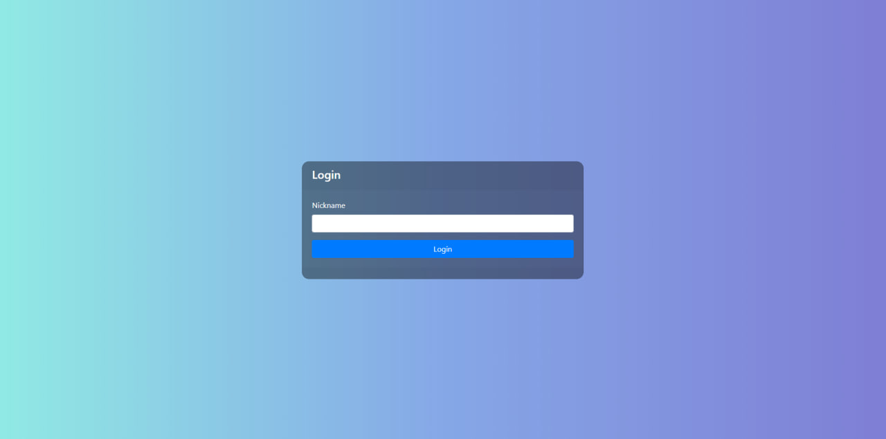
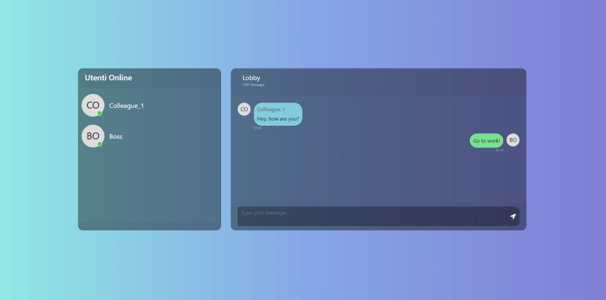

# Local Chat

University project built with **Express**, **Socket.IO**, and **npm**. The app allows users to log in and see in real time who else is connected, enabling instant chat within the same network. Designed to demonstrate real-time communication and multi-user interaction.

# Screenshots

---

